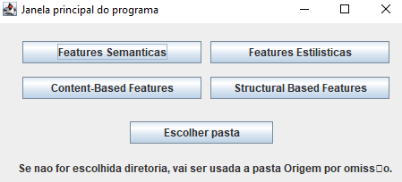

## FeatureExtractionSystem

Project done for CISUC by Hugo Redinho and Carolina Gonçalves.

Consists of a feature extractor for song lyrics consisting of:
- Semantic Features
- Structural Features
- Content-Based Features
- Structural-Based Features

## Docker Implementation
This docker implementation only takes into account the `all_features` extraction type. Other extraction types might need custom args and so a modded `Dockerfile`.

### Docker Env Vars
| Env | Default | Description |
| --- | --- | --- |
| feature | all_features | Type of extraction |
| inputDirectory | `/src/Origem/` | The input directory path (must match the specified volume) |
| outputFile | `/src/Output/outputFile.csv` | The output directory path (must match the specified volume) |

### Volumes
| Container Path | Description |
| --- | --- |
| `/src/Origem/` | Folder where the lyrics are accessed |
| `/src/Output/` | Folder where the generated waveform images are saved |

### Run Local Microservice
Build local `lyricsExtractor` image from source
```
docker build -t lyricsextractorlocal:latest .
```

Run local `lyricsExtractor` image
```
docker run -it --rm -v "<Local DIR>":"/src/Origem" -v "<Local DIR>":"/src/Output/" lyricsextractorlocal:latest
```

Run official `lyricsExtractor` image
```
docker run -it --rm -v "<Local DIR>":"/src/Origem" -v "<Local DIR>":"/src/Output/" lyricsextractor:latest
```

## Java Project
Every one of them has sub-features that can be extracted, either all at once or one at a time.

The project can be run in two ways:
By running the main class [MainInterface.java](src/Interface/MainInterface.java) and then a interactive menu will pop up:



In this window you can choose the type of feature selection you want, and then a sub-menu will pop up, or you can choose to select a folder to extract the files from.

If none is selected, the default folder is [Origem](src/Origem).
One example of the sub-menu (for Semantic Features) is:


Another way the project can be running is by using the [MainInterface.jar](MainInterface.jar) and running the following command:

*java -jar MainInterface.jar typeOfExtraction input outputFile* 

In terms of input (it can either be a file or a folder containing only the files with the right structure, the program will determine which one it is).
*Note:* Not all feature extraction types will extract to a csv, please look at the list below to see which ones do. 


The type of extraction can be one of the following:
- features_gi (for GI features)
    - Extracts to csv
- features_synesktech (for Synesktech features)
    - Extracts to csv
- features_dal_anew (for DAL & ANEW features)
    - Extracts to csv & also outputs a .txt with details
- features_gazeteers (for Gazeteers features)
    - Extracts to csv
- features_slang (for Slang features)
    - Extracts to csv
- features_capitalltetters (for Capital Letters features)
    - Extracts to csv
- features_standardPOS (for standard POS tagger features)
    - For each input file outputs a .txt with details
- features_cbf* (for content based features)
    - Extracts to csv
- features_titulo* (to extract the number of ocorrences of the title in a song)
    - Extracts to csv
- semantic_features (Extracts all semantic features onto a compiled csv file)
- stylistic_features (Similar to above, but for stylistic features)
- all_features (Combines the above extractions, also extracting semantic to "Semantic.csv" and stylistic to "Stylistic.csv")


One example would be: *java -jar MainInterface.jar "features_gi" "src/Origem" "outputFile.csv"*

Note: The features assigned with * have a different command line structure.

For *features_CBF* since it has more arguments, it has to be run in a different manner:

*java -jar MainInterface.jar features_cbf inputDirectory arg1 arg2 arg3*

Note: There's no outputFile path you can specify, the program makes it based on the arguments, check file [SaveInstancesInFile.java](src/AuxiliarFiles/SaveInstancesInFile.java) for details.

In regards to arg1, arg2 and arg3, they are parameters for the program, and they can be:
- *arg1*: unig, big, trig
- *arg2*: nada, st, sw, st+sw
- *arg3*: freq, bool, tfidf, norm

So one example would be: *java -jar MainInterface.jar "features_cbf" "src/Origem/" "unig" "nada" "freq"*

The name of the outputFile created is the combination of all three arguments, so for the example above the output file would be "unig_nada_freq.csv".

For *features_titulo* since you have to input the title of the file, the structure is as such:

*java -jar MainInterface.jar features_titulo inputFile outputFile titleSong"

So an example: *java -jar MainInterface.jar "features_titulo" "src/Lirica/tw_bl.txt" "tw_bl.txt" "Blinding Lights"*
